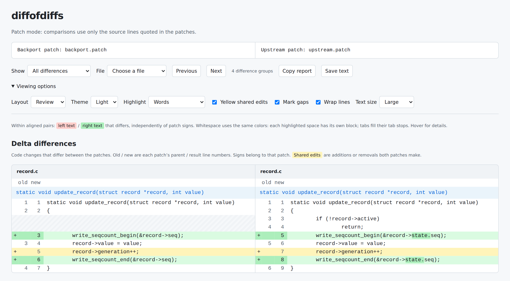
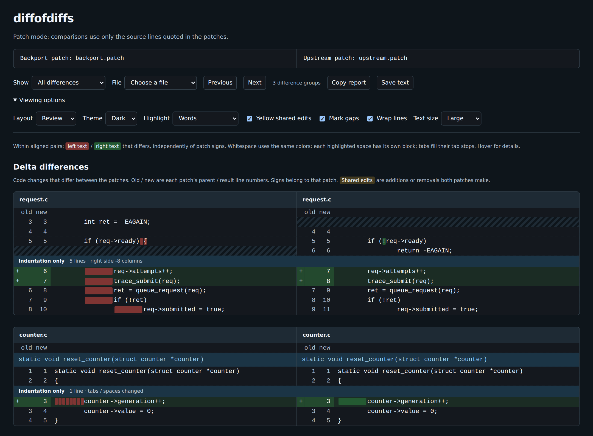

<!-- SPDX-License-Identifier: GPL-2.0-only -->

# diffofdiffs

diffofdiffs compares two versions of a patch side by side. Use it to review
a backport, compare revisions of a fix, or see what changed during a rebase.
It shows differences between the original edits and separately compares the
surrounding source in the resulting files.

- Compare patch files or commits in a local Git repository
- Keep each patch's original additions, removals, and line numbers
- Find changed arguments, identifiers, and indentation with inline highlights
- Share standalone HTML reports with themes, navigation, and viewing controls

diffofdiffs has two input modes. **Patch mode** compares patch files using
only the source lines quoted in them. **Tree mode** compares commits in a
Git repository using the complete files before and after each change.

Use tree mode whenever the commits are available. It provides a more
accurate and complete comparison: diffofdiffs can resolve matches that are
ambiguous in patch excerpts and show relevant surrounding differences that
neither patch quotes. Patch mode cannot recover that missing source.

## Why compare patches?

A clean [Git cherry-pick](https://git-scm.com/docs/git-cherry-pick) doesn't
guarantee that the new commit makes the same edits as the original patch.
Git's three-way merge accounts for changes already on your branch, so it can
treat part of a patch as already applied.

For example, a patch moves a line of code by deleting it from one place and
adding it in another. If your branch has already moved that line elsewhere,
Git can treat the deletion as already done and apply only the addition. The
cherry-pick succeeds without a conflict, but the line is now duplicated
instead of moved.

This is one of several ways a three-way merge can produce an unintended
result without reporting a conflict. diffofdiffs uses a two-way comparison
of the patches to show differences in their additions, deletions, and
surrounding code. In this example, it shows that the cherry-picked patch is
missing the original deletion.

## Examples

The images below are screenshots of diffofdiffs' actual standalone HTML
output. Each report is a single file that embeds its styles, scripts, and
viewing controls, so it works directly in a browser without a server or
network connection.

**Changed arguments and shared edits.** The extra `state.` in the upstream
calls is highlighted. Both patches add the same generation increment, shown
in yellow; the guard that exists only in the upstream source appears
opposite a hatched gap.



[HTML report](samples/arguments.html) | [Input patches](samples/arguments)

**Indentation, tabs, and spaces.** The first block has the same text under
different indentation: nested on one side, after an early return on the
other. The second example adds a line with eight spaces of indentation on
one side and a tab on the other, with separate color blocks for the spaces.



[HTML report](samples/indentation.html) | [Input patches](samples/indentation)

Download either HTML file and open it in a browser to try the controls.
The [sample notes](samples/README.md) give the report generation commands and
screenshot settings.

## Usage

### Patch mode

Compare two patch files:

```sh
diffofdiffs patch1.patch patch2.patch
```

Patch mode uses only the source lines quoted in the patches. Either operand
may be `-` for standard input, but not both.

### Tree mode

Compare two commits using the complete source files before and after each
commit:

```sh
diffofdiffs --git-tree=/path/to/repository commit1 commit2
```

Tree mode reads Git objects without checking out revisions or changing the
index.

### Output options

These options apply to both patch mode and tree mode. Add `--backport-labels`
to name the left side Backport and the right side Upstream.

Write a standalone HTML report:

```sh
diffofdiffs --html -o report.html patch1.patch patch2.patch
```

Open the report directly in a browser. Its styles, scripts, and controls are
embedded; it needs no server or network connection.

Use `-o FILE` or `--output=FILE` to save either text or HTML output. Without
this option, output goes to standard output; `-o -` also selects standard
output.

Terminal color is enabled automatically and disabled when output is
redirected. To keep color and highlight individual character changes:

```sh
diffofdiffs --color=always --highlight=characters patch1.patch patch2.patch
```

When writing to a terminal, diffofdiffs uses the available width and expands
source tabs at eight-column stops measured from each source line's start.
Set `--max-column-width=N` to cap each source column or `--tab-width=N` to
choose a positive tab width for terminal and HTML display. Saved text and
HTML source keep literal tabs.

The [user guide](GUIDE.md) walks through a sample report and explains line
numbers, context, highlighting, tabs, and comparison limits. Run
`diffofdiffs --help` for all options.

## Installation

Building from source requires:

- A compiler with GNU C17 support
- GNU make and Python 3.6 or newer
- libgit2 1.9.1 or newer, including its development headers

Older libgit2 releases can fail to read repositories with nested alternate
object stores; 1.9.1 includes the
[upstream fix](https://github.com/libgit2/libgit2/commit/17cbd2eae04807d12b49a73b60f2855b65c9d8ab).

Python embeds the HTML assets at build time. The executable needs libgit2 at
runtime; Python isn't a runtime dependency. The Userspace RCU (liburcu) list
headers are bundled, so liburcu doesn't need to be installed.
Use `CC` and `PYTHON` to select a compiler and Python interpreter. Set
`CPPFLAGS`, `CFLAGS`, and `LDFLAGS` to supply additional build flags.

From the source directory:

```sh
make
sudo make install
```

Use `make V=1` to show the full build commands.

The default destination is `/usr/local/bin/diffofdiffs`. To install for the
current user without root access:

```sh
make install prefix="$HOME/.local"
```

The Makefile supports `prefix`, `exec_prefix`, and `bindir`. By default,
`exec_prefix` follows `prefix`, and `bindir` is `$(exec_prefix)/bin`. Packagers
can use `DESTDIR` to stage an installation without changing its final prefix:

```sh
make install DESTDIR="$PWD/stage" prefix=/usr
```

This writes `stage/usr/bin/diffofdiffs`. To remove an installation, run
`make uninstall` with the same directory settings and permissions used for
installation. For example:

```sh
make uninstall prefix="$HOME/.local"
```

## Development

Checks require Python 3.9 or newer, Git, GNU patch, GNU diffutils, and
coreutils in addition to the build dependencies. `make check-asan` also
needs the compiler's AddressSanitizer and UndefinedBehaviorSanitizer runtime
libraries. Style checks use clang-format from `PATH` when it is available.
The current formatting baseline was produced with 22.1.8; no version is
enforced. Other versions may report formatting differences. See
[CODING_STYLE.md](CODING_STYLE.md) for the formatting rules.

```sh
make checkstyle
make check
make check-asan
```

See [tests/README.md](tests/README.md) for test coverage and optional corpus
validation. Read [CODING_STYLE.md](CODING_STYLE.md) before contributing code;
[DESIGN.md](DESIGN.md) describes the comparison engine, and
[CODE_DESIGN.md](CODE_DESIGN.md) records the design requirements.

## License and origin

diffofdiffs is licensed under [GPL-2.0-only](LICENSE). It grew out of
`interdiff --fuzzy` in
[Sultan Alsawaf's fork of patchutils.](https://github.com/kerneltoast/patchutils)

The bundled Userspace RCU list headers retain their
[LGPL-2.1-or-later license](vendor/urcu/LICENSE). See
the [vendoring notes](vendor/urcu/README.md) for their source and local changes.
